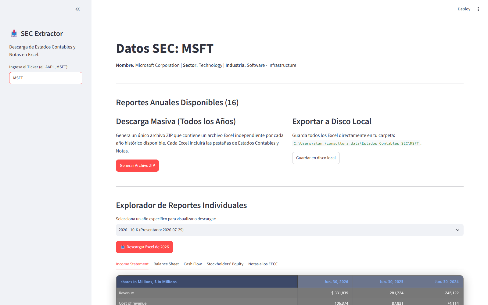
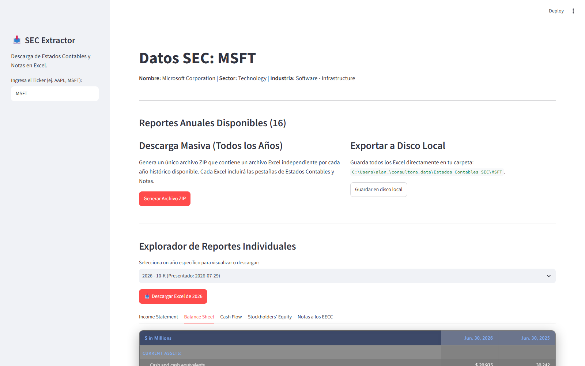

# Extractor y Estandarizador de Estados Financieros (SEC EDGAR)

Herramienta en Python para acceder a la fuente oficial (SEC EDGAR) de estados contables de cualquier ticker que cotice en EE.UU., y exportarlos de forma estandarizada a Excel.

> 📌 **Este repositorio es una vidriera del proyecto.** Documenta su funcionamiento y resultados con capturas reales. El código fuente es privado; este README explica arquitectura, alcance y stack técnico.

**Autor:** Alan Yapaze — [LinkedIn](https://www.linkedin.com/in/alan-yapaze/)
**Vigencia:** 2026

---

## Qué es

Un pipeline propio de ingesta y estandarización de reportes 10-K/10-Q directamente desde SEC EDGAR, con un visor en Streamlit para explorar Income Statement, Balance Sheet, Cash Flow, Stockholders' Equity y las notas a los estados contables de cualquier ticker — sin depender de proveedores de datos pagos.

La lógica de negocio y las decisiones de arquitectura son de autoría propia; la implementación de código fue desarrollada con asistencia de agentes de IA (Claude, Gemini) bajo un enfoque de *AI-augmented development* — dirigido por criterio financiero, no por experiencia previa como programador.

## Capturas (ejemplo: Microsoft, 10-K 2026)

16 años de reportes anuales disponibles, exportación individual o masiva (ZIP) a Excel, y exploración interactiva por año y tipo de estado contable.

### Income Statement

### Balance Sheet

### Cash Flow

## Qué resuelve — y por qué el alcance es el que es

La primera versión de este proyecto apuntaba a un motor de valuación completo (DCF, múltiplos comparables, ROIC ajustado a lo Damodaran) montado sobre los datos de SEC EDGAR. Al construirlo apareció un problema de fondo: la taxonomía XBRL de la SEC no está estandarizada entre emisores — cada empresa puede tagear sus partidas contables de forma distinta, lo que hacía frágil cualquier análisis automatizado sobre esos datos.

En lugar de forzar un análisis poco confiable sobre datos no estandarizados, el proyecto fue redefinido: hoy es una herramienta que **prioriza la integridad de la fuente** — ingesta directa, parseo estructurado y exportación limpia a Excel — dejando el análisis (DCF, comps, ratios) para hacerse manualmente sobre datos ya depurados. La misma decisión que aplico al auditar datos financieros: sin integridad de datos, no hay análisis posterior confiable.

## Lo que hace hoy

- Ingesta asíncrona desde SEC EDGAR respetando el rate-limit oficial (10 req/s) mediante control de concurrencia por semáforos.
- Parser propio (sin dependencias externas) para interpretar archivos XBRL R-files y extraer estados contables y notas de forma estructurada.
- Visor interactivo en Streamlit por ticker, año y tipo de estado contable.
- Exportación a Excel individual (por año) o masiva (ZIP con todos los años disponibles).

## Stack técnico

| Capa | Tecnologías |
|---|---|
| Ingesta | aiohttp (async, con control de concurrencia) |
| Parsing XBRL | Parser HTML propio (stdlib, sin BeautifulSoup) |
| Almacenamiento | SQLite (índice de filings y estados) |
| Exportación | openpyxl |
| Dashboard | Streamlit |
| Datos de mercado complementarios | yfinance |

## Contacto

¿Preguntas sobre el proyecto o interés en el desarrollo? [Alan Yapaze en LinkedIn](https://www.linkedin.com/in/alan-yapaze/)
